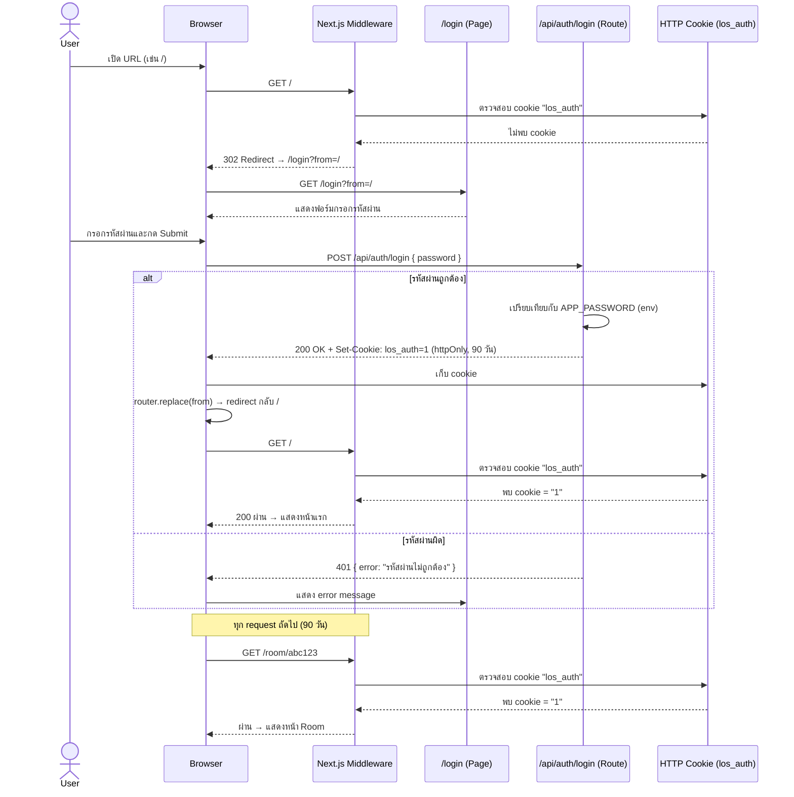

# Sequence Diagram: Authentication

```mermaid
sequenceDiagram
    actor User
    participant Browser
    participant Middleware as Next.js Middleware
    participant LoginPage as /login (Page)
    participant AuthAPI as /api/auth/login (Route)
    participant Cookie as HTTP Cookie (los_auth)

    %% ── Initial request to protected page ──────────────────────────────────
    User->>Browser: เปิด URL (เช่น /)
    Browser->>Middleware: GET /
    Middleware->>Cookie: ตรวจสอบ cookie "los_auth"
    Cookie-->>Middleware: ไม่พบ cookie

    Middleware-->>Browser: 302 Redirect → /login?from=/
    Browser->>LoginPage: GET /login?from=/
    LoginPage-->>Browser: แสดงฟอร์มกรอกรหัสผ่าน

    %% ── Login attempt ────────────────────────────────────────────────────
    User->>Browser: กรอกรหัสผ่านและกด Submit
    Browser->>AuthAPI: POST /api/auth/login { password }

    alt รหัสผ่านถูกต้อง
        AuthAPI->>AuthAPI: เปรียบเทียบกับ APP_PASSWORD (env)
        AuthAPI-->>Browser: 200 OK + Set-Cookie: los_auth=1 (httpOnly, 90 วัน)
        Browser->>Cookie: เก็บ cookie
        Browser->>Browser: router.replace(from) → redirect กลับ /
        Browser->>Middleware: GET /
        Middleware->>Cookie: ตรวจสอบ cookie "los_auth"
        Cookie-->>Middleware: พบ cookie = "1"
        Middleware-->>Browser: 200 ผ่าน → แสดงหน้าแรก
    else รหัสผ่านผิด
        AuthAPI-->>Browser: 401 { error: "รหัสผ่านไม่ถูกต้อง" }
        Browser->>LoginPage: แสดง error message
    end

    %% ── Subsequent requests ──────────────────────────────────────────────
    Note over Browser,Middleware: ทุก request ถัดไป (90 วัน)
    Browser->>Middleware: GET /room/abc123
    Middleware->>Cookie: ตรวจสอบ cookie "los_auth"
    Cookie-->>Middleware: พบ cookie = "1"
    Middleware-->>Browser: ผ่าน → แสดงหน้า Room
```
