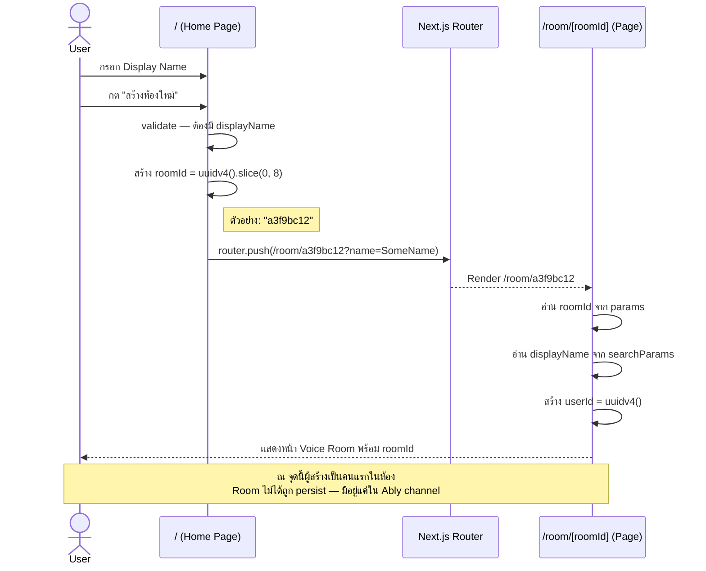

# Sequence Diagram: Create Room

```mermaid
sequenceDiagram
    actor User
    participant HomePage as / (Home Page)
    participant Router as Next.js Router
    participant RoomPage as /room/[roomId] (Page)

    User->>HomePage: กรอก Display Name
    User->>HomePage: กด "สร้างห้องใหม่"

    HomePage->>HomePage: validate — ต้องมี displayName
    HomePage->>HomePage: สร้าง roomId = uuidv4().slice(0, 8)
    Note right of HomePage: ตัวอย่าง: "a3f9bc12"

    HomePage->>Router: router.push(/room/a3f9bc12?name=SomeName)
    Router-->>RoomPage: Render /room/a3f9bc12

    RoomPage->>RoomPage: อ่าน roomId จาก params
    RoomPage->>RoomPage: อ่าน displayName จาก searchParams
    RoomPage->>RoomPage: สร้าง userId = uuidv4()

    RoomPage-->>User: แสดงหน้า Voice Room พร้อม roomId
    Note over User,RoomPage: ณ จุดนี้ผู้สร้างเป็นคนแรกในห้อง<br/>Room ไม่ได้ถูก persist — มีอยู่แค่ใน Ably channel
```
