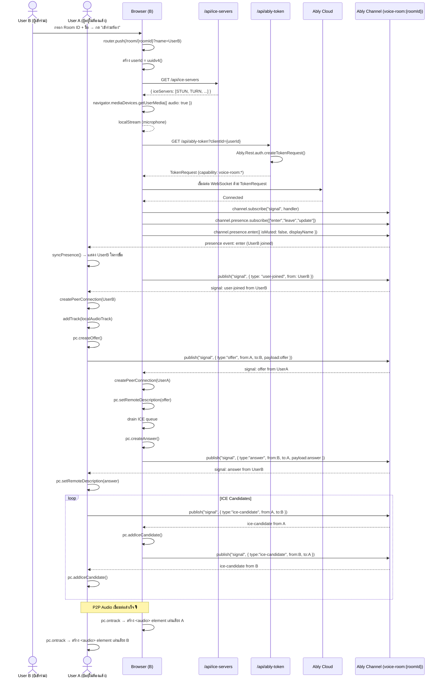

# Sequence Diagram: Join Room

```mermaid
sequenceDiagram
    actor UserB as User B (ผู้เข้าร่วม)
    actor UserA as User A (ผู้อยู่ในห้องแล้ว)
    participant Browser as Browser (B)
    participant ICE_API as /api/ice-servers
    participant AblyToken as /api/ably-token
    participant AblyCloud as Ably Cloud
    participant AblyChannel as Ably Channel (voice-room:{roomId})

    %% ── Navigate to room ─────────────────────────────────────────────────
    UserB->>Browser: กรอก Room ID + ชื่อ → กด "เข้าร่วมห้อง"
    Browser->>Browser: router.push(/room/{roomId}?name=UserB)
    Browser->>Browser: สร้าง userId = uuidv4()

    %% ── joinRoom() ───────────────────────────────────────────────────────
    Browser->>ICE_API: GET /api/ice-servers
    ICE_API-->>Browser: { iceServers: [STUN, TURN, ...] }

    Browser->>Browser: navigator.mediaDevices.getUserMedia({ audio: true })
    Browser-->>Browser: localStream (microphone)

    %% ── Ably Token Auth ──────────────────────────────────────────────────
    Browser->>AblyToken: GET /api/ably-token?clientId={userId}
    AblyToken->>AblyToken: Ably.Rest.auth.createTokenRequest()
    AblyToken-->>Browser: TokenRequest (capability: voice-room:*)

    Browser->>AblyCloud: เชื่อมต่อ WebSocket ด้วย TokenRequest
    AblyCloud-->>Browser: Connected

    %% ── Subscribe & Presence ─────────────────────────────────────────────
    Browser->>AblyChannel: channel.subscribe("signal", handler)
    Browser->>AblyChannel: channel.presence.subscribe(["enter","leave","update"])
    Browser->>AblyChannel: channel.presence.enter({ isMuted: false, displayName })
    AblyChannel-->>UserA: presence event: enter (UserB joined)
    UserA->>UserA: syncPresence() → แสดง UserB ในรายชื่อ

    %% ── Announce ─────────────────────────────────────────────────────────
    Browser->>AblyChannel: publish("signal", { type: "user-joined", from: UserB })
    AblyChannel-->>UserA: signal: user-joined from UserB

    %% ── WebRTC Offer (A → B) ─────────────────────────────────────────────
    UserA->>UserA: createPeerConnection(UserB)
    UserA->>UserA: addTrack(localAudioTrack)
    UserA->>UserA: pc.createOffer()
    UserA->>AblyChannel: publish("signal", { type:"offer", from:A, to:B, payload:offer })
    AblyChannel-->>Browser: signal: offer from UserA

    Browser->>Browser: createPeerConnection(UserA)
    Browser->>Browser: pc.setRemoteDescription(offer)
    Browser->>Browser: drain ICE queue
    Browser->>Browser: pc.createAnswer()
    Browser->>AblyChannel: publish("signal", { type:"answer", from:B, to:A, payload:answer })
    AblyChannel-->>UserA: signal: answer from UserB
    UserA->>UserA: pc.setRemoteDescription(answer)

    %% ── ICE Negotiation ──────────────────────────────────────────────────
    loop ICE Candidates
        UserA->>AblyChannel: publish("signal", { type:"ice-candidate", from:A, to:B })
        AblyChannel-->>Browser: ice-candidate from A
        Browser->>Browser: pc.addIceCandidate()

        Browser->>AblyChannel: publish("signal", { type:"ice-candidate", from:B, to:A })
        AblyChannel-->>UserA: ice-candidate from B
        UserA->>UserA: pc.addIceCandidate()
    end

    %% ── Connected ────────────────────────────────────────────────────────
    Note over Browser,UserA: P2P Audio เชื่อมต่อสำเร็จ 🎙
    Browser->>Browser: pc.ontrack → สร้าง <audio> element เล่นเสียง A
    UserA->>UserA: pc.ontrack → สร้าง <audio> element เล่นเสียง B
```
