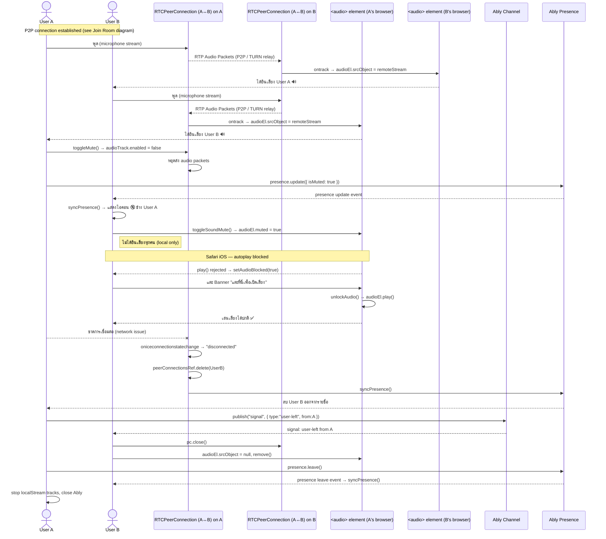

# Sequence Diagram: Voice Communications

```mermaid
sequenceDiagram
    actor UserA as User A
    actor UserB as User B
    participant PCA as RTCPeerConnection (A↔B) on A
    participant PCB as RTCPeerConnection (A↔B) on B
    participant AudioA as <audio> element (A's browser)
    participant AudioB as <audio> element (B's browser)
    participant AblyChannel as Ably Channel
    participant AblyPresence as Ably Presence

    Note over UserA,UserB: P2P connection established (see Join Room diagram)

    %% ── Audio Streaming ──────────────────────────────────────────────────
    UserA->>PCA: พูด (microphone stream)
    PCA-->>PCB: RTP Audio Packets (P2P / TURN relay)
    PCB->>AudioB: ontrack → audioEl.srcObject = remoteStream
    AudioB-->>UserB: ได้ยินเสียง User A 🔊

    UserB->>PCB: พูด (microphone stream)
    PCB-->>PCA: RTP Audio Packets (P2P / TURN relay)
    PCA->>AudioA: ontrack → audioEl.srcObject = remoteStream
    AudioA-->>UserA: ได้ยินเสียง User B 🔊

    %% ── Mute Microphone ──────────────────────────────────────────────────
    UserA->>PCA: toggleMute() → audioTrack.enabled = false
    PCA->>PCA: หยุดส่ง audio packets
    UserA->>AblyPresence: presence.update({ isMuted: true })
    AblyPresence-->>UserB: presence update event
    UserB->>UserB: syncPresence() → แสดงไอคอน 🔇 ข้าง User A

    %% ── Mute Remote Sound ────────────────────────────────────────────────
    UserB->>AudioA: toggleSoundMute() → audioEl.muted = true
    Note right of UserB: ไม่ได้ยินเสียงทุกคน (local only)

    %% ── iOS Audio Unlock ─────────────────────────────────────────────────
    Note over UserB,AudioA: Safari iOS — autoplay blocked
    AudioA-->>UserB: play() rejected → setAudioBlocked(true)
    UserB->>AudioA: แตะ Banner "แตะที่นี่เพื่อเปิดเสียง"
    AudioA->>AudioA: unlockAudio() → audioEl.play()
    AudioA-->>UserB: เล่นเสียงได้ปกติ ✅

    %% ── Connection Drop ──────────────────────────────────────────────────
    UserA--xPCA: ขาดการเชื่อมต่อ (network issue)
    PCA->>PCA: oniceconnectionstatechange → "disconnected"
    PCA->>PCA: peerConnectionsRef.delete(UserB)
    PCA->>AblyPresence: syncPresence()
    AblyPresence-->>UserA: ลบ User B ออกจากรายชื่อ

    %% ── Leave Room ───────────────────────────────────────────────────────
    UserA->>AblyChannel: publish("signal", { type:"user-left", from:A })
    AblyChannel-->>UserB: signal: user-left from A
    UserB->>PCB: pc.close()
    UserB->>AudioA: audioEl.srcObject = null, remove()
    UserA->>AblyPresence: presence.leave()
    AblyPresence-->>UserB: presence leave event → syncPresence()
    UserA->>UserA: stop localStream tracks, close Ably
```
