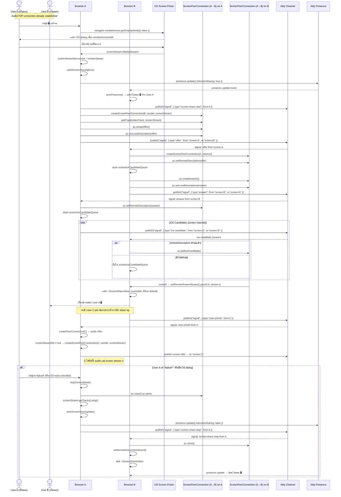

# Sequence Diagram: Screen Sharing

```mermaid
sequenceDiagram
    actor Sharer as User A (Sharer)
    actor Viewer as User B (Viewer)
    participant BrowserA as Browser A
    participant BrowserB as Browser B
    participant OS as OS Screen Picker
    participant ScreenPCA as ScreenPeerConnection (A→B) on A
    participant ScreenPCB as ScreenPeerConnection (A→B) on B
    participant AblyChannel as Ably Channel
    participant AblyPresence as Ably Presence

    Note over Sharer,Viewer: Audio P2P connection already established

    %% ── Start Screen Share ───────────────────────────────────────────────
    Sharer->>BrowserA: กดปุ่ม 🖥️ แชร์จอ
    BrowserA->>OS: navigator.mediaDevices.getDisplayMedia({ video })
    OS-->>Sharer: แสดง OS dialog เลือก window/screen/tab
    Sharer->>OS: เลือกหน้าจอที่ต้องการ
    OS-->>BrowserA: screenStream (MediaStream)

    BrowserA->>BrowserA: screenStreamRef.current = screenStream
    BrowserA->>BrowserA: setIsScreenSharing(true)
    BrowserA->>AblyPresence: presence.update({ isScreenSharing: true })
    AblyPresence-->>BrowserB: presence update event
    BrowserB->>BrowserB: syncPresence() → แสดงไอคอน 🖥️ ข้าง User A

    BrowserA->>AblyChannel: publish("signal", { type:"screen-share-start", from:A })

    %% ── Screen WebRTC Offer ──────────────────────────────────────────────
    BrowserA->>ScreenPCA: createScreenPeerConnection(B, sender, screenStream)
    BrowserA->>ScreenPCA: addTrack(videoTrack, screenStream)
    BrowserA->>ScreenPCA: pc.createOffer()
    BrowserA->>ScreenPCA: pc.setLocalDescription(offer)
    BrowserA->>AblyChannel: publish("signal", { type:"offer", from:"screen:A", to:"screen:B" })

    AblyChannel-->>BrowserB: signal: offer from screen:A

    %% ── Screen WebRTC Answer ─────────────────────────────────────────────
    BrowserB->>ScreenPCB: createScreenPeerConnection(A, receiver)
    BrowserB->>ScreenPCB: pc.setRemoteDescription(offer)
    BrowserB->>BrowserB: drain screenIceCandidateQueue
    BrowserB->>ScreenPCB: pc.createAnswer()
    BrowserB->>ScreenPCB: pc.setLocalDescription(answer)
    BrowserB->>AblyChannel: publish("signal", { type:"answer", from:"screen:B", to:"screen:A" })

    AblyChannel-->>BrowserA: signal: answer from screen:B
    BrowserA->>ScreenPCA: pc.setRemoteDescription(answer)
    BrowserA->>BrowserA: drain screenIceCandidateQueue

    %% ── ICE for Screen PC ────────────────────────────────────────────────
    loop ICE Candidates (screen channel)
        BrowserA->>AblyChannel: publish("signal", { type:"ice-candidate", from:"screen:A", to:"screen:B" })
        AblyChannel-->>BrowserB: ice-candidate (screen)

        alt remoteDescription พร้อมแล้ว
            BrowserB->>ScreenPCB: pc.addIceCandidate()
        else ยังไม่พร้อม
            BrowserB->>BrowserB: เก็บใน screenIceCandidateQueue
        end
    end

    %% ── Screen Stream Received ───────────────────────────────────────────
    ScreenPCB->>BrowserB: ontrack → setRemoteScreenStream({ peerId:A, stream })
    BrowserB->>BrowserB: แสดง <ScreenShareView> (resizable, 90vw default)
    BrowserB-->>Viewer: เห็นหน้าจอของ User A 🖥️

    %% ── Late Joiner ──────────────────────────────────────────────────────
    Note over BrowserA,BrowserB: กรณี User C join ห้องระหว่างที่ A กำลัง share อยู่
    BrowserB->>AblyChannel: publish("signal", { type:"user-joined", from:C })
    AblyChannel-->>BrowserA: signal: user-joined from C
    BrowserA->>BrowserA: createPeerConnection(C) → audio offer
    BrowserA->>BrowserA: screenStreamRef ≠ null → createScreenPeerConnection(C, sender, screenStream)
    BrowserA->>AblyChannel: publish screen offer → to:"screen:C"
    Note right of BrowserA: C ได้รับทั้ง audio และ screen stream ✅

    %% ── Stop Screen Share ────────────────────────────────────────────────
    alt User A กด "หยุดแชร์" หรือปิด OS dialog
        Sharer->>BrowserA: กดปุ่ม ⏹ หยุดแชร์ (หรือ OS track.onended)
        BrowserA->>BrowserA: stopScreenShare()
        BrowserA->>ScreenPCA: pc.close() ทุก peers
        BrowserA->>BrowserA: screenStream.getTracks().stop()
        BrowserA->>BrowserA: setIsScreenSharing(false)
        BrowserA->>AblyPresence: presence.update({ isScreenSharing: false })
        BrowserA->>AblyChannel: publish("signal", { type:"screen-share-stop", from:A })

        AblyChannel-->>BrowserB: signal: screen-share-stop from A
        BrowserB->>ScreenPCB: pc.close()
        BrowserB->>BrowserB: setRemoteScreenStream(null)
        BrowserB->>BrowserB: ซ่อน <ScreenShareView>
        AblyPresence-->>BrowserB: presence update → ซ่อนไอคอน 🖥️
    end
```
